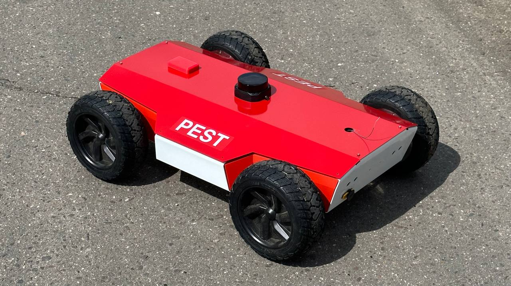

# __Streetbot4__

StreetBot4 is a simple yet powerfull outdoor 4WD diff drive robot, based on a stainless steel chasis and 8" hoverboard motor wheels.

It is equipped with an RPLIDAR S2, Intel Realsense D455 camera and 4 ultrasonic distance sensors. Motor wheels are controlled using 2 ODrive boards through CAN bus.
Robot is also rquipped with UAVCAN PEM module for monitoring battery state and consumed power and to provide 5V supply to onboard electronics.

Computational power of Streetbot4 is supplied by Raspberry Pi 4B which is dedicated to sensor reading, motor control and network communications and a Jetson Nano which is dedicated to video and lidar processing as well as navigation and planning.

## __What's in the project__

| Module                  | Description                                  |
|-------------------------|----------------------------------------------|
| not_ros/                | Different scripts and configs for OS         |
| odrive_can_ros_driver/  | ODrive CAN driver                            |
| rplidar_ros/            | RPLidar driver                               |
| sbus_serial/            | SBUS remote joystick driver                  |
| streetbot4_base/        | Hardware interface for diff drive controller |
| streetbot4_bringup/     | Bringup launch files                         |
| streetbot4_control/     | Movement controller                          |
| streetbot4_description/ | Robot description                            |
| streetbot4_drivers/     | Hardware drivers                             |
| streetbot4_gazebo/      | Gazebo simulation                            |
| streetbot4_navigation/  | Navigation stack                             |

## __Working with robot__

To run robot with basic functionality for tests on hardware:

``roslaunch streetbot4_bringup bringup_rpi.launch``

To run simulation:

``roslaunch streetbot4_gazebo streetbot4_office.launch``

To run model visualization and robot monitoring:

``roslaunch streetbot4_gazebo streetbot4_office.launch``
